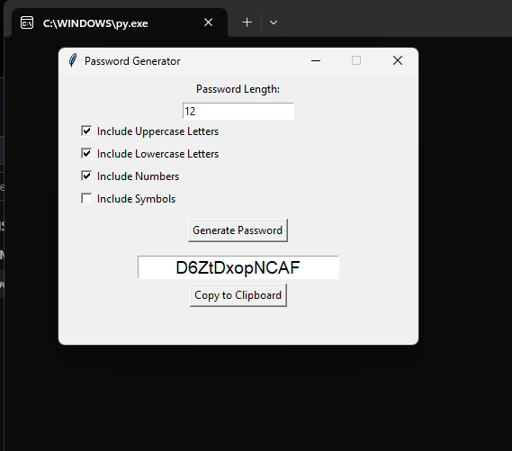

# PasswordGenerator
Password Generator App with Python.
-------------------------------------
# 🔐 Password Generator

A simple yet powerful password generator built with Python and Tkinter.  
Customize the length and character types to generate secure passwords in seconds!

---

## ✨ Features

- Choose password length  
- Include:
  - Uppercase letters (A–Z)
  - Lowercase letters (a–z)
  - Numbers (0–9)
  - Symbols (!, @, #, etc.)
- One-click password generation
- Copy password to clipboard
- Clean and responsive GUI

---

## 📸 Preview

 <!-- (optional if you add screenshot later) -->

---

## 🚀 Getting Started

### 🔧 Requirements

- Python 3.x  
- [pyperclip](https://pypi.org/project/pyperclip/) for clipboard support:
  (pip install pyperclip)

## Project Structure
password_generator/
├── password_generator.py
├── README.md
└── requirements.txt

## 🛡️ License
This project is licensed under the MIT License.
